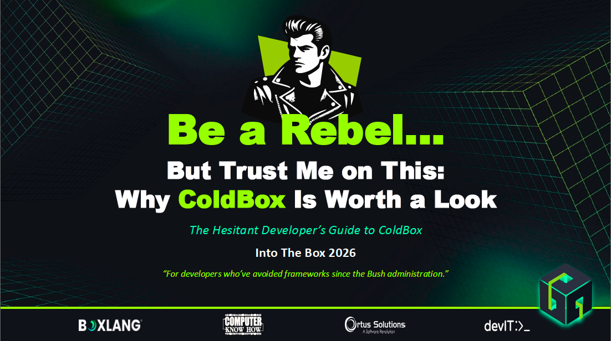

# Be a Rebel… But Trust Me on This: Why ColdBox Is Worth a Look

### The Hesitant Developer's Guide to ColdBox

**[📄 Download the Presentation (PDF)](ITB2026-ColdBox-Rebel.pdf)**

---

## About This Talk

> _"For developers who've avoided frameworks since the Bush administration."_

A session for the framework-skeptical CFML developer. If your app has a file named
`utils.cfm`, you route everything through `index.cfm?do=something&please=work`, and
your idea of dependency injection is copying the same `createObject()` call into 47
files, this talk is for you.

ColdBox solves the pain we all know (messy routing, scattered business logic, brittle
legacy patterns, and 2 AM spaghetti debugging) by giving you a foundation for building
**cleaner, safer, and more maintainable** applications. The pitch to the skeptics: ColdBox
gives you _more_ control over your codebase, not less, and you can adopt it incrementally
without burning your existing app down.

> _ColdBox doesn't ask you to stop being a rebel._

## Session Details

| | |
|---|---|
| **Event** | [Into the Box 2026](https://www.intothebox.org/) |
| **Date & Time** | Thursday, April 30th · 10:15 AM |
| **Level** | All levels |
| **Topics** | ColdBox · Legacy Modernization · CFML · AI Productivity |
| **Session Page** | [intothebox.org →](https://www.intothebox.org/into-the-box/sessions/detail?slug=sessions/be-a-rebel-but-trust-me-on-this-why-coldbox-is-worth-a-look) |

## What's Covered

- **The Rebel Mindset**: why we resist frameworks, and the myth that "framework = loss of control"
- **The Pain We All Know**: chaos *is* a framework; it's just an undocumented one
- **Routing: Before & After**: 47 `<cfif>` conditions vs. a clean, predictable `Router.cfc`
- **One Framework, Your Choice of Language**: ColdBox 8 on classic CFML, mixed BoxLang, or BoxLang Prime (`bx-coldbox`) with no forced migration
- **ColdBox in 60 Seconds**: MVC conventions, the module ecosystem, CommandBox, TestBox, and 20 years battle-tested
- **The Ecosystem**: WireBox, LogBox, CBSecurity, TestBox, cbValidation, CBWire
- **Security: Stop Rolling Your Own**: auth, RBAC, declarative rules, CSRF, OWASP headers, SSO, and passkeys
- **Tests: The Case You're Ignoring**: isolated, testable business logic and real CI/CD
- **Plays Nice With Legacy**: coexistence, incremental routes, service extraction, and the Strangler pattern
- **Migration Without Mutiny**: technical _and_ team strategy ("The word _rewrite_ starts wars. The word _improve_ starts progress.")
- **CommandBox: The Gateway**: package & server management, scaffolding, task runners, and the REPL
- **Your Next 3 Minutes**: `box install coldbox` → `coldbox create app myApp` → `server start`

## Resources

| Resource | What You'll Find |
|---|---|
| [coldbox.org](https://coldbox.org) | All things ColdBox |
| [ortusbooks.com](https://ortusbooks.com) | All the Box docs |
| [cfcasts.com](https://cfcasts.com) | Bite-size video tutorials from the Box gurus |
| [community.ortussolutions.com](https://community.ortussolutions.com) | Community forum for CFML & BoxLang developers |
| [ortussolutions.com](https://www.ortussolutions.com) | Training & support |
| [forgebox.io](https://forgebox.io) | Module marketplace |
| [apidocs.ortussolutions.com](https://apidocs.ortussolutions.com) | Dig even deeper |

## Speaker

**Michael Rigsby**, Senior ColdFusion Developer

- Developing ColdFusion applications since ~1999
- Reformed ColdBox-hesitant developer 😉
- Frequent contributor to CBWire

📫 mrigsby@gmail.com · [@mike-rigsby](https://github.com/mike-rigsby) · [@mrigsby](https://twitter.com/mrigsby)

---

_If you hate it, you've lost 3 minutes. If you don't… welcome to the rebellion._

